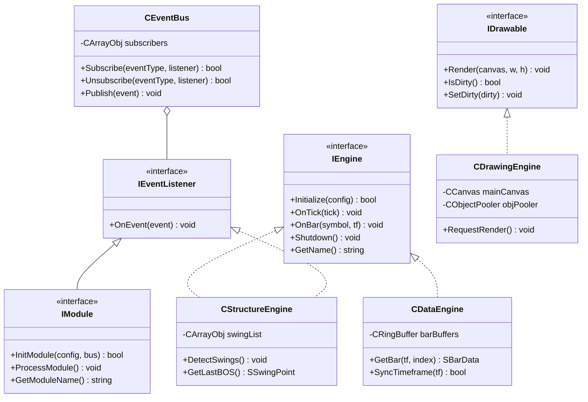

# PROJECT SENTINEL: Phase 0 - Complete Software Architecture Specification

**Author**: Lead Software Architect  
**Project**: SENTINEL - Professional Trading Analysis Framework for MetaTrader 5 (MQL5)  
**Status**: Pending Review & Approval  

---

## Executive Overview

Project **SENTINEL** is an institutional-grade, event-driven, modular quantitative analysis framework designed for MetaTrader 5 (MQL5). It is engineered to support **100+ future trading modules** (Smart Money Concepts, ICT, Volume Profile, Order Flow, Delta, VWAP, AI Probability Engine, Dashboard, EA, Backtesting) on a single high-performance engine without structural refactoring.

The system is decoupled using **Clean Architecture** and **SOLID Principles**:
- Business logic is strictly separated from visual rendering.
- Communication between engines occurs exclusively via an asynchronous/synchronous **Event Bus**.
- Heap allocations are minimized through pre-allocated **Object Pools** and static **Ring Buffers**.

---

## 1. Folder Structure & Rationale

```
Include/SENTINEL/
├── Core/           # Universal definitions, base structs, macros, and core abstract interfaces.
├── Events/         # Event Bus dispatcher, subscriber registry, and event data structures.
├── Data/           # DataEngine & TickEngine managing multi-timeframe price series & real-time tick delta.
├── Engines/        # Specialized domain analytical engines (Structure, Zone, Volume, Price, Probability, Signal, Alert, Stats).
├── Modules/        # Dynamic strategy plugins (SMC, ICT, Volume Profile, Session, Order Flow).
├── UI/             # Dashboard HUD controls, interactive panels, tables, and buttons.
├── Drawing/        # Render pipeline (CCanvas double buffering, ThemeManager, ObjectPooler).
├── Config/         # Hierarchical configuration repository and parameter containers.
├── Logging/        # Diagnostic logging framework (Console & File output streams).
├── Alerts/         # Multi-channel notification routing (Popups, Push, Webhooks).
├── Statistics/     # System telemetry, tick processing latency, and memory profiling.
├── Backtesting/    # Tick replay simulator and historical strategy backtester bridge.
├── EA/             # Execution layer, risk management, and order management engine.
├── Memory/         # Memory managers, CObjectPool templates, and CRingBuffer structures.
├── Resources/      # Icons, images, sound files, fonts, and preset JSON templates.
├── Tests/          # Automated test harness for unit/integration testing.
└── Utilities/      # Pure mathematical, time-formatting, and array helper functions.

Indicators/SENTINEL/
└── SENTINEL_Master.mq5 # Primary MT5 indicator host script.
```

---

## 2. Module Structure

Every strategy feature (e.g., SMC, ICT, Volume Profile) is encapsulated as a standalone module implementing the `IModule` interface. Modules are isolated plugins registered with the `CModuleManager`.

```
 +------------------------------------------------------------------+
 |                            IModule                               |
 | + InitModule(config, eventBus): bool                             |
 | + ProcessModule(): void                                          |
 | + OnEvent(event): void                                           |
 | + GetModuleName(): string                                        |
 +------------------------------------------------------------------+
          ^                         ^                         ^
          |                         |                         |
 +-----------------+       +-----------------+       +-----------------+
 |   CSMCModule    |       |   CICTModule    |       | CVolumeModule   |
 +-----------------+       +-----------------+       +-----------------+
```

---

## 3. Engine Responsibilities

| Engine | Primary Responsibility | Single Responsibility Principle |
| :--- | :--- | :--- |
| **`CConfigEngine`** | Stores, updates, and validates system runtime parameters. | Central setting storage. |
| **`CLogger`** | Traces system operation across configurable severity levels. | System logging. |
| **`CDataEngine`** | Fetches and syncs multi-timeframe bar data without freezing the main thread. | MTF bar data provider. |
| **`CTickEngine`** | Captures real-time tick stream and calculates buyer/seller delta. | Real-time tick aggregator. |
| **`CPriceEngine`** | Computes price volatility (ATR), range extremes, and premium/discount levels. | Price statistical analytics. |
| **`CStructureEngine`**| Detects swing points, Break of Structure (BOS), and Change of Character (CHoCH). | Market structure analysis. |
| **`CLiquidityEngine`**| Identifies equal highs/lows, trendline liquidity, and sweep events. | Liquidity pool tracking. |
| **`CZoneEngine`** | Identifies, tracks, and manages mitigation state of Order Blocks, FVGs, and S/D zones. | Supply/Demand & OB zone lifecycle. |
| **`CVolumeEngine`** | Computes Volume Profiles, VWAP bands, and absorption clusters. | Volume & Order Flow analytics. |
| **`CProbabilityEngine`**| Evaluates multi-factor confluence scoring across structure, zones, and volume. | Quantitative probability scoring. |
| **`CSignalEngine`** | Generates actionable buy/sell setups based on probability scores. | Setup signal generation. |
| **`CDrawingEngine`** | Manages double-buffered CCanvas overlays and native chart object recycling. | Graphics rendering coordinator. |
| **`CAlertEngine`** | Dispatches notifications to Terminal popups, Mobile Push, and Webhooks. | Multi-channel alert dispatching. |
| **`CDashboardEngine`**| Renders interactive HUD controls, statistics tables, and toggle buttons. | User interface HUD management. |
| **`CModuleManager`** | Controls dynamic loading, execution order, and teardown of modules. | Plugin lifecycle manager. |

---

## 4. Comprehensive Class Diagram (Mermaid)



---

## 5. Data Flow Pipeline

```
[MT5 Terminal] ---> [SENTINEL_Master.mq5]
                           |
                           v
                    [CDataEngine & CTickEngine]
                           |
                           +---> Updates Bar/Tick Ring Buffers
                           |
                           v
                    [CEventBus Dispatcher]
                           |
     +---------------------+---------------------+
     |                     |                     |
     v                     v                     v
[CStructureEngine]    [CZoneEngine]      [CVolumeEngine]
     |                     |                     |
     +---------------------+---------------------+
                           |
                           v Emits Events
                    [CEventBus Dispatcher]
                           |
                           +---> [CProbabilityEngine] ---> [CSignalEngine]
                           |
                           v
                  [CDrawingEngine] ---> Renders to MT5 Chart
```

---

## 6. Event Flow & Event Types

### Core Event Bus (`CEventBus`) Mechanism
Communication across engines occurs via typed `SSentinelEvent` structs published to `CEventBus`:

```cpp
enum ENUM_SENTINEL_EVENT_TYPE
{
   EVENT_TICK = 1,          // Real-time tick update
   EVENT_NEW_BAR,           // New bar closed on a monitored timeframe
   EVENT_SWING_FOUND,       // Swing High or Swing Low confirmed
   EVENT_BOS,               // Break of Structure detected
   EVENT_CHOCH,             // Change of Character detected
   EVENT_ZONE_CREATED,      // Order Block / FVG zone created
   EVENT_ZONE_MITIGATED,    // Zone touched/invalidated by price
   EVENT_LIQUIDITY_SWEEP,   // Buy-side or Sell-side liquidity swept
   EVENT_VWAP_UPDATE,       // VWAP / Standard Deviation band recalculation
   EVENT_CONFLUENCE_SCORE,  // Confluence score recalculated
   EVENT_SIGNAL_GENERATED,  // Buy/Sell setup signal ready
   EVENT_ALERT_TRIGGERED    // Alert notification generated
};
```

---

## 7. Object Lifecycle Management

```
      +-------------------------------------------------------+
      |                 INITIALIZATION PHASE                  |
      | 1. Instantiate CLogger & CConfigEngine                |
      | 2. Instantiate CEventBus & CObjectPooler              |
      | 3. Register Core Engines with CEventBus               |
      | 4. Load & Initialize Dynamic Modules via CModuleManager|
      +-------------------------------------------------------+
                                  |
                                  v
      +-------------------------------------------------------+
      |                   EXECUTION PHASE                     |
      | 1. OnTick / OnCalculate received from MT5              |
      | 2. Update Data Engine ring buffers                     |
      | 3. Dispatch events through CEventBus                   |
      | 4. Engines update state & mark CDrawingEngine Dirty   |
      | 5. If Dirty, CDrawingEngine re-renders offscreen canvas|
      +-------------------------------------------------------+
                                  |
                                  v
      +-------------------------------------------------------+
      |                  TEARDOWN PHASE                       |
      | 1. Notify Modules via OnDestroy()                     |
      | 2. Shutdown Core Engines in reverse order             |
      | 3. Clear Object Pooler (Delete temporary MT5 objects) |
      | 4. Release CCanvas memory buffers & Log shutdown      |
      +-------------------------------------------------------+
```

---

## 8. Rendering Pipeline (Double-Buffering & Recycler)

Chart rendering uses a hybrid approach to guarantee zero flicker and low CPU utilization:
1. **Dynamic High-Frequency Overlays (Volume Profile, Heatmaps, Histograms)**: Rendered on an off-screen `CCanvas` bitmap buffer and blitted to the chart in a single redraw call.
2. **Interactive UI / Zone Labels (Buttons, Panels, Zone Text)**: Managed by `CObjectPooler`. MT5 chart objects are created once during startup, hidden when inactive (`OBJPROP_TIMEFRAME = OBJ_NO_TIMEFRAMES`), and updated in-place rather than deleted and recreated.

---

## 9. Tick Processing Pipeline

1. **Incoming Tick**: `OnTick(const MqlTick &tick)` received by host script.
2. **Filter & Timestamp Check**: `CTickEngine` validates volume flags and microsecond timestamp to ignore duplicate ticks.
3. **Delta Estimation**: Evaluates bid/ask delta (Buyer-initiated vs Seller-initiated volume).
4. **Buffer Push**: Pushes `STickData` to static ring buffer `CRingBuffer<STickData>`.
5. **Intra-bar Calculation**: Updates real-time candle metrics in `CDataEngine`.

---

## 10. Multi-Timeframe (MTF) Architecture

- **Multi-Buffer Storage**: `CDataEngine` encapsulates separate `CRingBuffer<SBarData>` containers for `M1`, `M5`, `M15`, `H1`, `H4`, `D1`.
- **Non-Blocking Fetch**: Synchronizes timeframe data via MT5 `SeriesInfoInteger()` check prior to calling `CopyRates()`.
- **Time-Index Mapping**: Performs fast binary search on bar timestamps (`BarIndexByTime()`) to align lower-timeframe events with higher-timeframe market structure.

---

## 11. Configuration System

- Hierarchical parameter manager `CConfigEngine` using key-value storage.
- Key format: `engine.subsystem.parameter` (e.g. `structure.swing.length = 5`).
- Values injected into engines at initialization; no hardcoded numbers inside analytical algorithms.

---

## 12. Logging Framework

- Static thread-safe `CLogger` delivering formatted output.
- Severity Levels: `LOG_LEVEL_DEBUG`, `LOG_LEVEL_INFO`, `LOG_LEVEL_WARN`, `LOG_ERROR`.
- High-frequency debug calls wrapped in preprocessor macros to eliminate string evaluation in release builds.

---

## 13. Error Handling Architecture

- All engine methods return `ENUM_SENTINEL_STATUS` status codes.
- Failures (e.g., historical data sync timeout) fail gracefully by logging the error and falling back to cached state without crashing the MT5 terminal.

---

## 14. Memory Management Strategy

- **Static Pre-Allocation**: Primary collections use `CRingBuffer` template with pre-allocated array memory.
- **Auto-Cleanup Pointer Collections**: Dynamic array storage utilizes `CArrayObj` with `FreeMode(true)`.
- **Object Recycler Pool**: Graphic objects are recycled from a fixed pool (`SENTINEL_OBJECT_POOL_SIZE = 500`).

---

## 15. Performance Strategy

- **Target Metrics**: Tick processing latency < 0.1 ms; chart rendering time < 2 ms; memory usage < 50 MB.
- **Dirty-State Flagging**: Visual rendering is triggered **only** when `IDrawable::IsDirty()` returns true.
- **Zero Heap Reallocations**: Dynamic arrays are never resized inside live tick loops.

---

## 16. Future Plugin System

- Dynamic registration via `CModuleManager::RegisterModule(IModule *module)`.
- Plugins query engine interfaces (`IStructureEngine`, `IZoneEngine`) and listen to `CEventBus` events without modifying core framework files.

---

## 17. Coding Standards

- SOLID principles, low coupling, high cohesion.
- Strict variable initialization and null pointer checks (`IS_VALID_POINTER`).
- Clean separation of business logic from drawing/GUI logic.

---

## 18. Naming Conventions

- **Classes**: `C` prefix, PascalCase (e.g., `CStructureEngine`).
- **Interfaces**: `I` prefix, PascalCase (e.g., `IEventListener`).
- **Structs**: `S` prefix, PascalCase (e.g., `SBarData`).
- **Enums**: `ENUM_` prefix, UPPERCASE (e.g., `ENUM_SENTINEL_EVENT`).
- **Member Variables**: `m_` prefix, camelCase (e.g., `m_swingLength`).
- **Global Macros/Constants**: `SENTINEL_` prefix, UPPER_CASE (e.g., `SENTINEL_VERSION`).

---

## 19. File Organization

```
Include/SENTINEL/
  Core/ (Defs.mqh, Types.mqh, Interfaces.mqh)
  Events/ (Event.mqh, EventType.mqh, EventBus.mqh)
  Config/ (ConfigParam.mqh, ConfigEngine.mqh)
  Logging/ (LogLevel.mqh, Logger.mqh)
  Memory/ (ObjectPool.mqh, RingBuffer.mqh)
  Data/ (BarSeries.mqh, DataEngine.mqh, TickEngine.mqh)
  Engines/ (BaseEngine.mqh, PriceEngine.mqh, StructureEngine.mqh, ZoneEngine.mqh, VolumeEngine.mqh, ProbabilityEngine.mqh, SignalEngine.mqh, AlertEngine.mqh, StatisticsEngine.mqh)
  Modules/ (BaseModule.mqh, ModuleManager.mqh, SMC/, ICT/, Volume/, Session/)
  UI/ (Controls/, DashboardEngine.mqh)
  Drawing/ (CanvasBuffer.mqh, ObjectPooler.mqh, ThemeManager.mqh, DrawingEngine.mqh)
  Utilities/ (MathUtils.mqh, TimeUtils.mqh, ArrayUtils.mqh)
```

---

## 20. Milestone Build Order

1. **Phase 0**: Architectural Blueprint & Specification (Current Step)
2. **Phase 1**: Foundation & Core Headers (Types, Defs, Interfaces, Logger, Config, RingBuffer)
3. **Phase 2**: Event Bus & Data Core (DataEngine, TickEngine, EventBus)
4. **Phase 3**: Core Analysis Engines (StructureEngine, ZoneEngine, VolumeEngine)
5. **Phase 4**: Rendering & UI Framework (DrawingEngine, Canvas, ObjectPooler)
6. **Phase 5**: Dynamic Plugin Framework & Signals (ModuleManager, SMC/ICT plugins, SignalEngine)
7. **Phase 6**: Dashboard HUD & Master Indicator (`SENTINEL_Master.mq5`)

---

## Output Format Verification (Phase 0 Summary)

- **Overview**: Addressed in Executive Overview & Section 1.
- **Architecture**: Addressed in Sections 1, 2, 4, 5, 7, 8, 9, 10, 16.
- **Reasoning**: Decoupled event-driven system allows 100+ strategy modules to be added seamlessly without modifying core code.
- **Folder Structure**: Addressed in Section 1.
- **Class Structure & Interfaces**: Addressed in Sections 2, 4.
- **Responsibilities**: Addressed in Section 3.
- **Advantages**: Institutional stability, zero-flicker double-buffered rendering, zero-allocation memory buffers, high tick throughput.
- **Possible Risks**: High event volume during fast market moves; mitigated by direct reference passing in `SSentinelEvent`.
- **Future Improvements**: Dynamic C++ DLL integration for GPU-accelerated machine learning scoring in `CProbabilityEngine`.

---

> [!IMPORTANT]
> **Phase 0 is complete and presented for your review.**
> Implementation code (Phase 1) will not begin until this specification is explicitly approved.
