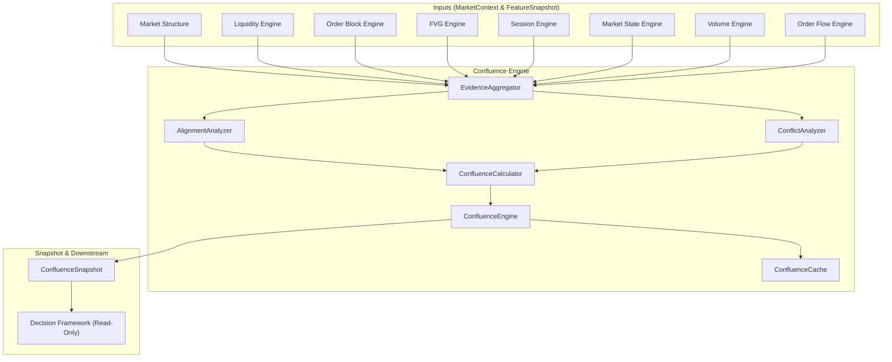
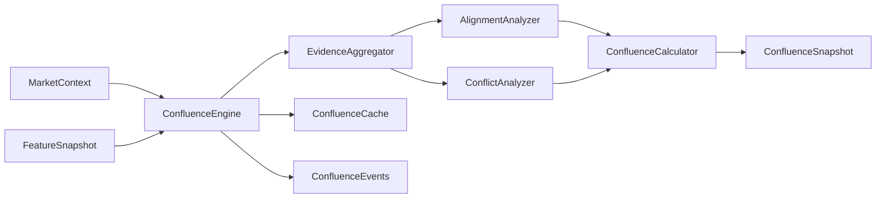

# Phase 15: Confluence Engine

## Objective
The **Confluence Engine** provides a strategy-independent analytical layer measuring directional agreement, accordance, and conflict across all 8 core analytical components built in Project Sentinel.

It calculates an immutable `ConfluenceSnapshot` from `MarketContext` and `FeatureSnapshot`. It does **NOT** generate BUY or SELL signals, nor does it access MetaTrader 5 API or execute trades.

---

## Folder Tree
```
Include/SENTINEL/Engines/Confluence/
├── ConfluenceAnalyzer.mqh
├── ConfluenceCache.mqh
├── ConfluenceCalculator.mqh
├── ConfluenceConfiguration.mqh
├── ConfluenceEngine.mqh
├── ConfluenceEvents.mqh
├── ConfluenceRepository.mqh
├── ConfluenceSnapshot.mqh
├── ConfluenceStatistics.mqh
├── ConfluenceTypes.mqh
├── ConfluenceValidator.mqh
├── EvidenceAggregator.mqh
├── AlignmentAnalyzer.mqh
├── ConflictAnalyzer.mqh
└── IConfluenceEngine.mqh
```

---

## Supported Evidence Sources
1. **Market Structure**: Trend bias, higher highs / lower lows, structural swing alignment.
2. **Liquidity**: Buy-Side Liquidity (BSL) vs. Sell-Side Liquidity (SSL) sweeps and pool proximity.
3. **Order Blocks**: Active bullish vs. bearish Order Block count and dominance.
4. **Fair Value Gaps**: Active unfilled bullish vs. bearish Fair Value Gap dominance.
5. **Session**: Active trading session expansion and volatility direction.
6. **Market State**: Trending, Ranging, Expansion, or Consolidation regime bias.
7. **Volume**: Buying pressure vs. selling pressure and relative volume delta.
8. **Order Flow Approximation**: Cumulative order delta and order imbalance.

---

## Class Responsibilities
- `ConfluenceEngine`: Primary engine facade implementing `IConfluenceEngine`.
- `EvidenceAggregator`: Standardizes raw evidence across all 8 modules into `SEvidenceFactor` objects.
- `AlignmentAnalyzer`: Computes agreement ratio (`0.0` to `1.0`) among supporting evidence factors.
- `ConflictAnalyzer`: Computes polarization index (`0.0` to `1.0`) among opposing evidence factors.
- `ConfluenceCalculator`: Synthesizes net directional bias, overall score (`-1.0` to `+1.0`), alignment, conflict, and categorical strength.
- `ConfluenceCache` & `ConfluenceRepository`: Ring-buffer storage (64 snapshots) for high-frequency access.
- `ConfluenceEvents`: Publishes `EVENT_CONFLUENCE_UPDATED`, `EVENT_ALIGNMENT_CHANGED`, `EVENT_CONFLICT_CHANGED`.

---

## Architecture Diagram


---

## Dependency Diagram


---

## Performance & Memory Notes
- **Heap Allocation Zero-Guarantee**: All snapshot structures use fixed-size arrays (`SEvidenceFactor evidenceList[8]`) with value semantics. Zero dynamic heap allocations occur during evaluation.
- **O(1) Evaluation Complexity**: Evidence aggregation and mathematical scoring execute in constant time $O(1)$ across the fixed set of 8 analytical sources.
- **Cache Overhead**: The ring buffer maintains 64 snapshots in contiguous memory, requiring under 32 KB RAM total.
