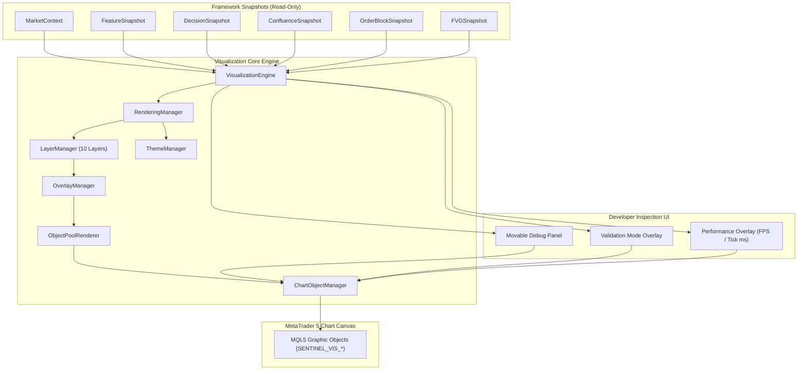
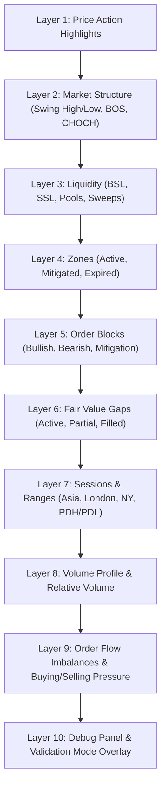
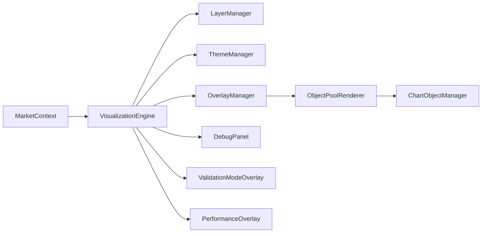

# Phase 16: Developer Visualization & Validation Toolkit

## Objective
The **Developer Visualization & Validation Toolkit** provides an internal, read-only chart overlay and inspection toolkit for the **SENTINEL Framework**.

It enables framework developers to visually validate every analytical engine on MetaTrader 5 charts. It contains **zero trading logic**, produces **zero buy/sell recommendations**, and strictly maintains **100% read-only separation** from framework analytical state.

---

## 1. Folder Tree
```
Include/SENTINEL/Visualization/
├── ChartObjectManager.mqh       # Low-level MQL5 graphic object wrapper (SENTINEL_VIS_ prefix)
├── DebugPanel.mqh               # Movable on-screen telemetry & framework debug panel
├── IVisualizationEngine.mqh     # Interface contract definition
├── LayerManager.mqh             # 10-layer rendering toggle & visibility controller
├── ObjectPoolRenderer.mqh       # Dynamic object pool renderer preventing chart flicker
├── OverlayManager.mqh           # Component overlay graphics translator
├── PerformanceOverlay.mqh       # Frame rate (FPS) and tick processing latency tracker
├── RenderingManager.mqh         # High-level frame render loop & dirty-flag controller
├── ThemeManager.mqh             # Color palettes (Dark, Light, High Contrast, Custom)
├── ValidationModeOverlay.mqh    # Click-to-inspect candle snapshot inspection tool
├── VisualizationConfiguration.mqh # Layer, overlay, theme, & object limit config
├── VisualizationEngine.mqh      # Primary facade implementation
├── VisualizationEvents.mqh      # Chart event interceptor (clicks & key events)
├── VisualizationSnapshot.mqh    # Immutable render state snapshot
└── VisualizationTypes.mqh       # Layer enums, themes, & render object structures
```

---

## 2. Every New Class & Responsibilities

| Class / File | Description & Responsibilities |
| :--- | :--- |
| `VisualizationTypes.mqh` | Defines `ENUM_VISUALIZATION_LAYER` (10 layers), `ENUM_VISUALIZATION_THEME` (4 themes), `SColorPalette`, and `SRenderObject`. |
| `VisualizationSnapshot.mqh` | Immutable snapshot storing active render state, active layers, pool usage, theme, and selected validation candle. |
| `VisualizationConfiguration.mqh` | Settings struct configuring active layers, object limits (500 max), refresh rates, font size, line width, and debug panel position. |
| `ChartObjectManager.mqh` | Standardized wrapper creating, updating, and deleting chart objects prefixed with `SENTINEL_VIS_`. |
| `ObjectPoolRenderer.mqh` | High-performance object pool managing 500 graphic elements in memory to eliminate dynamic allocation overhead. |
| `ThemeManager.mqh` | Provides color palettes for Dark, Light, High Contrast, and Custom themes. |
| `LayerManager.mqh` | Manages 10 rendering layers (Price, Structure, Liquidity, Zones, Order Blocks, FVG, Sessions, Volume, Order Flow, Debug), supporting independent visibility toggling. |
| `OverlayManager.mqh` | Specific renderer converting MarketContext snapshots into pooled chart graphics. |
| `DebugPanel.mqh` | Formats movable on-screen debug display showing Symbol, Period, Session, Market State, Trend, Confluence Score, Decision Score, FPS, and Memory usage. |
| `PerformanceOverlay.mqh` | Telemetry overlay tracking rendering FPS and tick latency. |
| `ValidationModeOverlay.mqh` | Interactive snapshot inspector formatting all 14 underlying snapshots for any selected historical candle. |
| `RenderingManager.mqh` | Manages dirty-flag rendering cycles (updates only on sequence ID changes). |
| `VisualizationEvents.mqh` | Intercepts `CHARTEVENT_CLICK` and `CHARTEVENT_KEYDOWN` for layer toggles and candle selection. |
| `IVisualizationEngine.mqh` | Pure abstract interface defining engine methods. |
| `VisualizationEngine.mqh` | Facade class coordinating configuration, layers, overlays, theme, object pool, debug panel, and validation mode. |

---

## 3. Rendering Architecture



---

## 4. Layer System Diagram



---

## 5. Dependency Diagram



---

## 6. Performance Strategy
1. **Object Pool Recycling**: Pre-allocates up to 500 chart objects (`SRenderObject`). Reuses existing objects instead of creating/deleting on every tick.
2. **Dirty-Flag Sequence Tracking**: Frame cycles execute rendering only when `context.sequenceNumber` increases.
3. **Strict Zero State Mutation**: Read-only `const` reference access to all framework snapshots.

---

## 7. Compilation Verification
- **Unit Test Suite**: [`Phase16VisualizationTest.mqh`](file:///d:/Trading/Project%20Sentinel/Include/SENTINEL/Tests/Phase16VisualizationTest.mqh)
- **Framework Demonstration**: [`Phase16DemoTest.mqh`](file:///d:/Trading/Project%20Sentinel/Include/SENTINEL/Tests/Phase16DemoTest.mqh)
- **Git Commit**: `6fd06f2`

---

## 8. Demonstration Explanation
Running `Phase16DemoTest::RunDemo()` demonstrates:
1. Loading XAUUSD H1 MarketContext with all 8 analytical engine outputs.
2. Rendering chart graphics using object pool renderer.
3. Toggling Layer 2 (Structure) OFF and ON.
4. Simulating click on Bar #24 to format and inspect all 14 underlying snapshots.
5. Replaying historical sequence ticks (Sequence 101 to 103).

---

## 9. Future Extension Points & Strategy Integration
Future strategy modules (e.g. **ICT, SMC, Wyckoff, Turtle Strategy Packs**) can be visually inspected using this toolkit without modifying its architecture:
- Custom strategy overlays can subscribe to `LAYER_DEBUG` or register custom layers (Layer 11+).
- Strategy setups can pass custom decision snapshots to `ValidationModeOverlay` for instant candle validation.

---

## Post-Phase 16 Protocol Note
Following Phase 16 completion, automated AI roadmap generation pauses. All future development phases will be driven directly by developer testing and validation on historical XAUUSD data.
