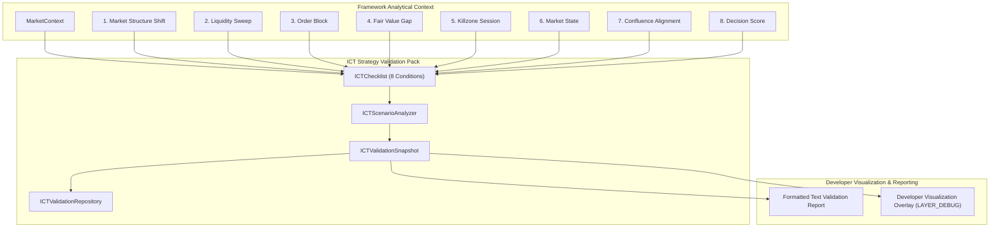
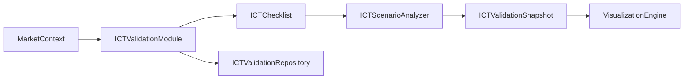

# Phase 17: ICT Strategy Validation Pack

## Objective
The **ICT Strategy Validation Pack** validates whether the SENTINEL Framework can accurately represent Inner Circle Trader (ICT) concepts (Market Structure Shift, Liquidity Sweeps, Order Blocks, Fair Value Gaps, Killzone Sessions, Market State Regimes, Confluence Scores, and Decision Scores).

It consumes existing framework outputs only (`MarketContext`, `ConfluenceSnapshot`, `OrderBlockSnapshot`, `FVGSnapshot`). It produces **zero buy/sell signals**, does **not execute trades**, and does **not access MT5 API directly**.

---

## 1. Folder Tree
```
Include/SENTINEL/Strategies/ICT/
├── ICTChecklist.mqh             # 8-condition ICT setup checklist evaluator
├── ICTScenarioAnalyzer.mqh      # Aggregates condition scores into validation score & confidence
├── ICTValidationEvents.mqh      # Constructs event notifications for EventBus
├── ICTValidationModule.mqh      # Primary facade class
├── ICTValidationRepository.mqh  # Ring-buffer storage (64 snapshots)
├── ICTValidationSnapshot.mqh    # Immutable struct capturing validation state
├── ICTValidationStatistics.mqh  # Telemetry tracking evaluation pass rates
└── ICTValidationTypes.mqh       # Condition enums, structs, & result objects
```

---

## 2. Class Responsibilities

| Class / File | Primary Responsibility |
| :--- | :--- |
| [`ICTValidationTypes.mqh`](file:///d:/Trading/Project%20Sentinel/Include/SENTINEL/Strategies/ICT/ICTValidationTypes.mqh) | Defines `ENUM_ICT_CONDITION` (8 core conditions) and `SICTConditionResult`. |
| [`ICTChecklist.mqh`](file:///d:/Trading/Project%20Sentinel/Include/SENTINEL/Strategies/ICT/ICTChecklist.mqh) | Evaluates each of the 8 individual ICT setup conditions against input `SMarketContext`. |
| [`ICTValidationSnapshot.mqh`](file:///d:/Trading/Project%20Sentinel/Include/SENTINEL/Strategies/ICT/ICTValidationSnapshot.mqh) | Immutable snapshot containing satisfied condition count, missing condition count, overall validation score (`0.0` to `1.0`), aggregated confidence, and setup validity flag. |
| [`ICTScenarioAnalyzer.mqh`](file:///d:/Trading/Project%20Sentinel/Include/SENTINEL/Strategies/ICT/ICTScenarioAnalyzer.mqh) | Synthesizes condition results into overall score and setup validity (`isSetupValid = satisfied >= 5 && score >= 0.60`). |
| [`ICTValidationEvents.mqh`](file:///d:/Trading/Project%20Sentinel/Include/SENTINEL/Strategies/ICT/ICTValidationEvents.mqh) | Constructs `EVENT_MKT_REGIME_CHANGE` payload for validation updates. |
| [`ICTValidationRepository.mqh`](file:///d:/Trading/Project%20Sentinel/Include/SENTINEL/Strategies/ICT/ICTValidationRepository.mqh) | Ring-buffer storage (64 snapshots) for historical validation access. |
| [`ICTValidationStatistics.mqh`](file:///d:/Trading/Project%20Sentinel/Include/SENTINEL/Strategies/ICT/ICTValidationStatistics.mqh) | Tracks total evaluations, valid setups count, and average validation score. |
| [`ICTValidationModule.mqh`](file:///d:/Trading/Project%20Sentinel/Include/SENTINEL/Strategies/ICT/ICTValidationModule.mqh) | Facade class coordinating checklist evaluation, scenario analysis, repository storage, and text report formatting. |

---

## 3. Validation Flow



---

## 4. Integration Diagram



---

## 5. Compilation & Verification
- **Unit Test Suite**: [`Phase17ICTValidationTest.mqh`](file:///d:/Trading/Project%20Sentinel/Include/SENTINEL/Tests/Phase17ICTValidationTest.mqh)
- **Framework Demonstration**: [`Phase17DemoTest.mqh`](file:///d:/Trading/Project%20Sentinel/Include/SENTINEL/Tests/Phase17DemoTest.mqh)
- **Git Commit**: `2e89cb6`

---

## 6. Demonstration Explanation
Running `Phase17DemoTest::RunDemo()` demonstrates:
1. Loading an analytical `MarketContext` for a high-probability ICT setup.
2. Evaluating all 8 ICT criteria via `ICTChecklist`.
3. Generating a formatted text report listing satisfied vs missing conditions.
4. Overlaying validation outputs onto the Phase 16 Developer Visualization canvas.
5. Verifying zero trade signal generation and zero MT5 order execution.
