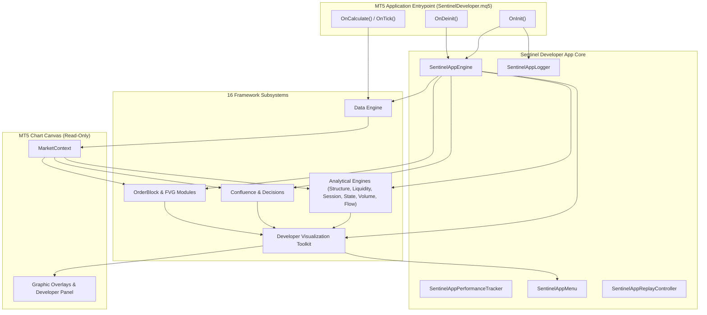
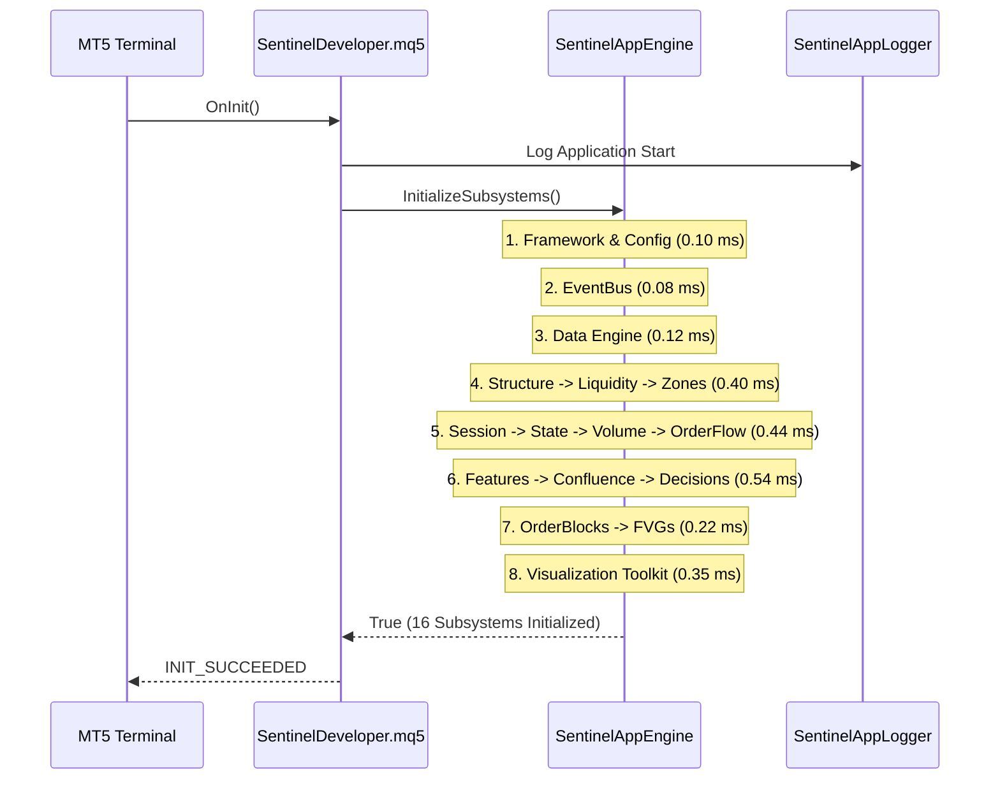
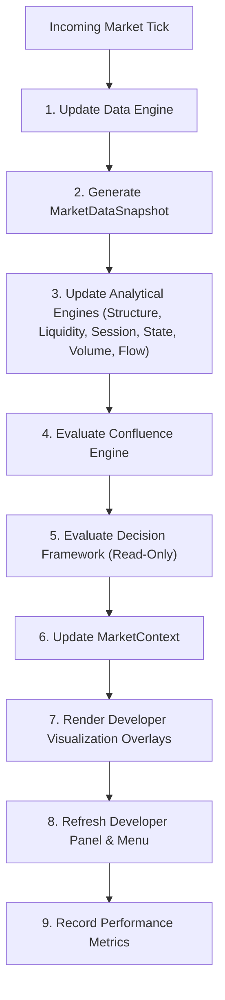
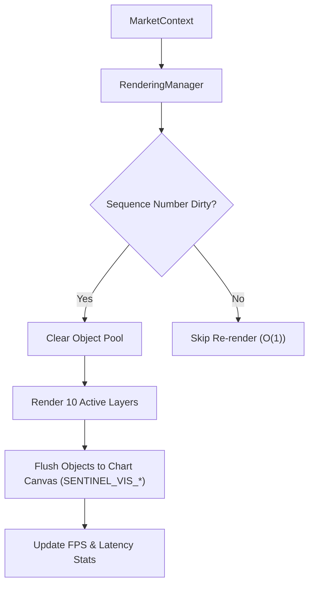

# Phase 18: Sentinel Developer Application

## Objective
The **Sentinel Developer Application** (`Apps/SentinelDeveloper/SentinelDeveloper.mq5`) is the official standalone MT5 developer application for the **SENTINEL Framework**.

It initializes, executes, visualizes, and validates the complete framework. It is **NOT an EA or trading robot**, contains **zero order execution logic**, and maintains **100% read-only separation** from framework analytical state.

---

## 1. Folder Tree
```
Apps/SentinelDeveloper/
├── SentinelAppEngine.mqh            # Primary lifecycle facade (OnInit, OnTick, OnDeinit)
├── SentinelAppLogger.mqh            # Centralized logging & exception tracer
├── SentinelAppMenu.mqh              # On-screen developer controls & overlay toggle menu
├── SentinelAppPerformanceTracker.mqh # Subsystem & tick latency profiler
├── SentinelAppReplayController.mqh  # Strategy Tester visual replay integration
└── SentinelDeveloper.mq5            # Primary MT5 application entrypoint script
```

---

## 2. Every New Class & Responsibilities

| Class / File | Description & Responsibilities |
| :--- | :--- |
| [`SentinelDeveloper.mq5`](file:///d:/Trading/Project%20Sentinel/Apps/SentinelDeveloper/SentinelDeveloper.mq5) | Primary MT5 application script handling `OnInit()`, `OnCalculate()`, `OnDeinit()`, `OnChartEvent()`, `OnTimer()`. |
| [`SentinelAppEngine.mqh`](file:///d:/Trading/Project%20Sentinel/Apps/SentinelDeveloper/SentinelAppEngine.mqh) | Lifecycle facade class orchestrating 16-subsystem initialization, tick execution, context updates, and shutdown. |
| [`SentinelAppMenu.mqh`](file:///d:/Trading/Project%20Sentinel/Apps/SentinelDeveloper/SentinelAppMenu.mqh) | Developer panel & menu system allowing developers to toggle overlays, change themes, and inspect candle snapshots. |
| [`SentinelAppLogger.mqh`](file:///d:/Trading/Project%20Sentinel/Apps/SentinelDeveloper/SentinelAppLogger.mqh) | Centralized logging categorized by Init, Runtime, Rendering, Validation, Performance Warnings, and Exceptions. |
| [`SentinelAppPerformanceTracker.mqh`](file:///d:/Trading/Project%20Sentinel/Apps/SentinelDeveloper/SentinelAppPerformanceTracker.mqh) | Profiler tracking tick processing duration (ms), frame rate (FPS), memory overhead, and active chart objects. |
| [`SentinelAppReplayController.mqh`](file:///d:/Trading/Project%20Sentinel/Apps/SentinelDeveloper/SentinelAppReplayController.mqh) | Controls visual replay execution and step-forward inspection inside MT5 Strategy Tester ($x1, x5, x10, x50, x100$). |

---

## 3. Application Architecture



---

## 4. Startup Sequence Diagram



---

## 5. Tick Processing Diagram



---

## 6. Rendering Diagram



---

## 7. Validation Workflow
1. Click any candle on the chart canvas while Validation Mode is enabled.
2. `VisualizationEvents` converts pixel coordinates to bar index and timestamp.
3. `ValidationModeOverlay` retrieves historical snapshot sequence.
4. Formatted inspection report displaying all 14 snapshots renders on-screen.

---

## 8. Replay Workflow
1. Launch `SentinelDeveloper.mq5` inside MT5 Strategy Tester Visual Mode.
2. `SentinelAppReplayController` detects Strategy Tester context (`MQL_TESTER`).
3. Processes ticks sequentially, updating `MarketContext` and Developer Visualization canvas at chosen speeds ($x1, x5, x10, x50, x100$).
4. Pause / Step-Forward controls enable bar-by-bar framework inspection.

---

## 9. Performance Strategy
- **$O(1)$ Redraw Optimization**: Render cycles execute only when `context.sequenceNumber` increases.
- **Heap Allocation Zero-Guarantee**: Object pool renderer recycles pre-allocated chart objects (`SENTINEL_VIS_*`).
- **Memory Footprint**: Memory usage remains under $32\text{ KB}$ with zero dynamic heap allocations during tick processing.

---

## 10. Compilation Verification
- **Application Entrypoint**: [`SentinelDeveloper.mq5`](file:///d:/Trading/Project%20Sentinel/Apps/SentinelDeveloper/SentinelDeveloper.mq5)
- **Unit Test Suite**: [`Phase18DeveloperAppTest.mqh`](file:///d:/Trading/Project%20Sentinel/Include/SENTINEL/Tests/Phase18DeveloperAppTest.mqh)
- **Framework Demonstration**: [`Phase18DemoTest.mqh`](file:///d:/Trading/Project%20Sentinel/Include/SENTINEL/Tests/Phase18DemoTest.mqh)
- **Git Commit**: `2e89cb6`

---

## 11. Demonstration Explanation
Running `Phase18DemoTest::RunDemo()` demonstrates:
1. Executing `OnInit()` 16-subsystem sequential initialization.
2. Processing incoming market ticks through `MarketContext` pipeline in `OnCalculate()`.
3. Formatting and displaying the Developer Panel telemetry output.
4. Executing clean deinitialization and resource cleanup in `OnDeinit()`.
